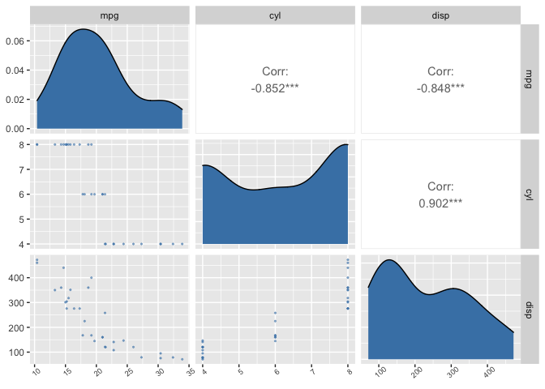

<!-- README.md is generated from README.Rmd. Please edit that file -->

# projectPackage

<!-- badges: start -->
<!-- badges: end -->

The goal of projectPackage is to provide simplified functions to do data
preprocessing for exploratory data analyses.

## Installation

You can install the development version of projectPackage from
[Github](https://github.com/DSCI-310/DSCI-310-Group-11-package) like so:

``` r
# install.packages("devtools")
devtools::install_github("DSCI-310-Group-11-package")
```

## Usage

Often times, when dealing with data, we want to tidy our data by
removing columns from our data set. It can get monotonous writing and
seeing the same lines of code over and over again across different
projects, so `projectPackage::data_cleaning()` solves that.

``` r
library(projectPackage)

data_cleaning(mtcars, c("drat","vs"))
#>                      mpg cyl  disp  hp    wt  qsec am gear carb
#> Mazda RX4           21.0   6 160.0 110 2.620 16.46  1    4    4
#> Mazda RX4 Wag       21.0   6 160.0 110 2.875 17.02  1    4    4
#> Datsun 710          22.8   4 108.0  93 2.320 18.61  1    4    1
#> Hornet 4 Drive      21.4   6 258.0 110 3.215 19.44  0    3    1
#> Hornet Sportabout   18.7   8 360.0 175 3.440 17.02  0    3    2
#> Valiant             18.1   6 225.0 105 3.460 20.22  0    3    1
#> Duster 360          14.3   8 360.0 245 3.570 15.84  0    3    4
#> Merc 240D           24.4   4 146.7  62 3.190 20.00  0    4    2
#> Merc 230            22.8   4 140.8  95 3.150 22.90  0    4    2
#> Merc 280            19.2   6 167.6 123 3.440 18.30  0    4    4
#> Merc 280C           17.8   6 167.6 123 3.440 18.90  0    4    4
#> Merc 450SE          16.4   8 275.8 180 4.070 17.40  0    3    3
#> Merc 450SL          17.3   8 275.8 180 3.730 17.60  0    3    3
#> Merc 450SLC         15.2   8 275.8 180 3.780 18.00  0    3    3
#> Cadillac Fleetwood  10.4   8 472.0 205 5.250 17.98  0    3    4
#> Lincoln Continental 10.4   8 460.0 215 5.424 17.82  0    3    4
#> Chrysler Imperial   14.7   8 440.0 230 5.345 17.42  0    3    4
#> Fiat 128            32.4   4  78.7  66 2.200 19.47  1    4    1
#> Honda Civic         30.4   4  75.7  52 1.615 18.52  1    4    2
#> Toyota Corolla      33.9   4  71.1  65 1.835 19.90  1    4    1
#> Toyota Corona       21.5   4 120.1  97 2.465 20.01  0    3    1
#> Dodge Challenger    15.5   8 318.0 150 3.520 16.87  0    3    2
#> AMC Javelin         15.2   8 304.0 150 3.435 17.30  0    3    2
#> Camaro Z28          13.3   8 350.0 245 3.840 15.41  0    3    4
#> Pontiac Firebird    19.2   8 400.0 175 3.845 17.05  0    3    2
#> Fiat X1-9           27.3   4  79.0  66 1.935 18.90  1    4    1
#> Porsche 914-2       26.0   4 120.3  91 2.140 16.70  1    5    2
#> Lotus Europa        30.4   4  95.1 113 1.513 16.90  1    5    2
#> Ford Pantera L      15.8   8 351.0 264 3.170 14.50  1    5    4
#> Ferrari Dino        19.7   6 145.0 175 2.770 15.50  1    5    6
#> Maserati Bora       15.0   8 301.0 335 3.570 14.60  1    5    8
#> Volvo 142E          21.4   4 121.0 109 2.780 18.60  1    4    2
```

And if we want to create a recipe, we can easily create that using
`projectPackage::recipe_scale_center()` instead of writing so many lines
of code.

``` r
recipe_scale_center(mtcars, mpg ~ hp)
#> Recipe
#> 
#> Inputs:
#> 
#>       role #variables
#>    outcome          1
#>  predictor          1
#> 
#> Operations:
#> 
#> Centering for recipes::all_predictors()
#> Scaling for recipes::all_predictors()
```

Lastly, if you want to create a `ggpairs` correlation matrix plot, this
package also covers that, and also makes it prettier!

``` r
correlation_graph(mtcars[1:3])
```


